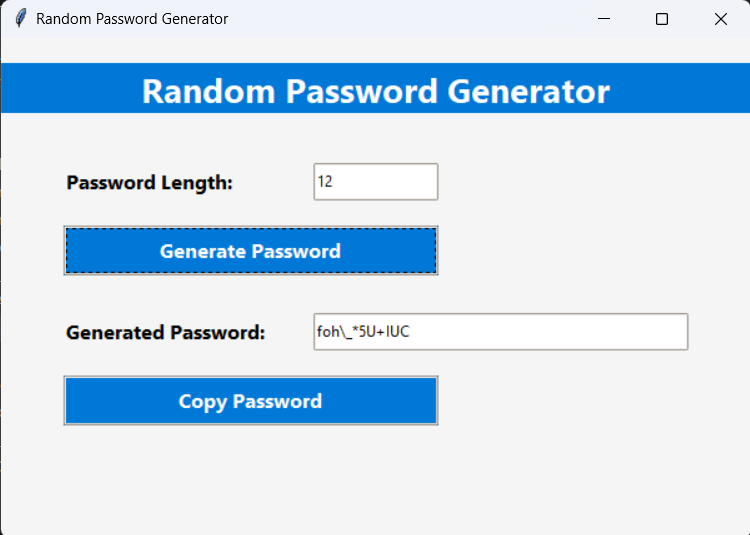

  <h1>Random Password Generator</h1>
  
This <strong>Random Password Generator</strong> application is a Python-based GUI tool designed to help users create secure and customizable passwords. Built with the <strong>Tkinter</strong> library, it offers an intuitive interface for generating random passwords with a specified length and copying them to the clipboard.

    
<h2>Features</h2>
<ul>
        <li><strong>Password Length Customization:</strong>
            <ul>
                <li>Allows users to specify the desired password length (minimum 4 characters).</li>
            </ul>
        </li>
        <li><strong>Random Password Generation:</strong>
            <ul>
                <li>Generates strong passwords containing lowercase letters, uppercase letters, digits, and special characters.</li>
            </ul>
        </li>
        <li><strong>Copy to Clipboard:</strong>
            <ul>
                <li>One-click functionality to copy the generated password for easy use.</li>
            </ul>
        </li>
</ul>
  

  

<h2>How to Use</h2>
<ol>
        <li><strong>Enter Password Length:</strong> 
In the "Password Length" field, input the number of characters for the password (minimum 4).

        </li>
        <li><strong>Generate Password:</strong>
            
Click the "Generate Password" button to create a random password. The password will appear in the "Generated Password" field.

        </li>
        <li><strong>Copy Password:</strong>
            
After generating a password, click the "Copy Password" button to copy it to your clipboard. You can now paste it wherever needed.

        </li>
</ol>

This application is perfect for creating secure passwords for online accounts, systems, or any personal use.

